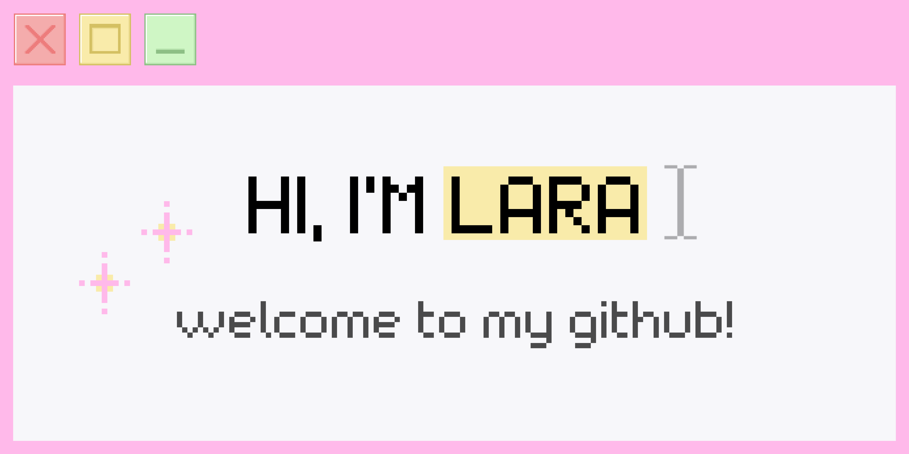

  

    
  

   

  <h3 align="center">
    <samp>
      BSc Computer Science @ UAB  
      ML Engineer Intern @ CVC    
      Specialized in Machine Learning & Computer Vision
    </samp>
  </h3>

  

    
    
  

   

  

    <samp>
      I am a Computer Science graduate passionate about teaching machines how to "see" and "think".  
      Always looking for new challenges that help me grow and apply my knowledge in real-world projects.
    </samp>
  

 

<h2 align="center">
  <samp><b>&lt; TECH STACK /&gt;</b></samp>
</h2>

  <table>
    <tr>
      <td align="center" width="120"><samp><b>Languages</b></samp></td>
      <td align="center">
        
        
        
        
        
      </td>
    </tr>
    <tr>
      <td align="center" width="120"><samp><b>Frameworks</b></samp></td>
      <td align="center">
         
         
         
         
      </td>
    </tr>
    <tr>
      <td align="center" width="120"><samp><b>Computer Vision</b></samp></td>
      <td align="center">
         
      </td>
    </tr>
    <tr>
      <td align="center" width="120"><samp><b>DevOps</b></samp></td>
      <td align="center">
         
         
         
      </td>
    </tr>
    <tr>
      <td align="center" width="120"><samp><b>Data Stack</b></samp></td>
      <td align="center">
         
         
      </td>
    </tr>
    <tr>
      <td align="center" width="120"><samp><b>Graphics & 3D</b></samp></td>
      <td align="center">
         
         
      </td>
    </tr>
  </table>

